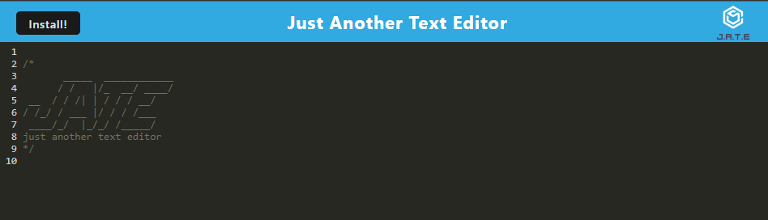

# Text Editor

## Description

This a text editor that runs in the browser. The app is a single-page application that meets the PWA criteria. Additionally, it features a number of data persistence techniques that serves as redundancy in case one of the options is not supported by the browser. The application function offline.

## Installation

- Make sure to install Node.js
- Install required npm dependencies (npm i)

## Usage

Navigate to the root directory of the project in your terminal and install the dependencies with 'npm i' then start the server with npm start. The application will be deployed on your [localhost with port 3000](http://localhost:3000/). When you first start the application you should see something similar to the image below. You can now use the text editor and it will save all changes you make automatically as you make changes to it.

## Heroku Link

[Deployed Link on Heroku](https://text-editor-pwa-backend.herokuapp.com/)

## Credit

N/A

## License

N/A
